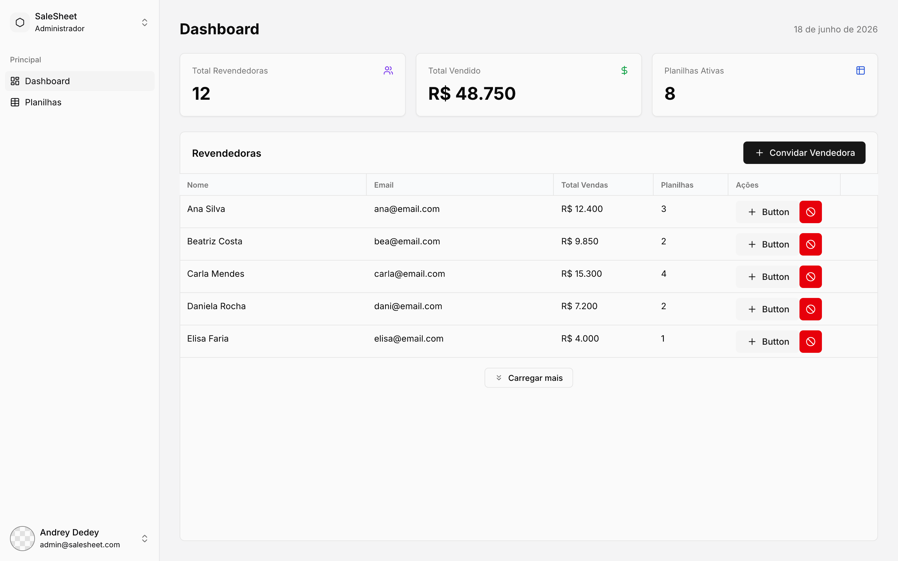
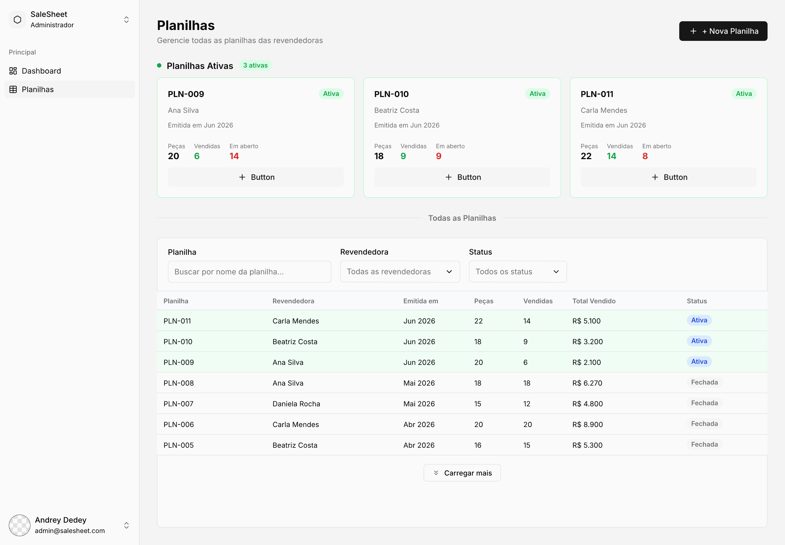
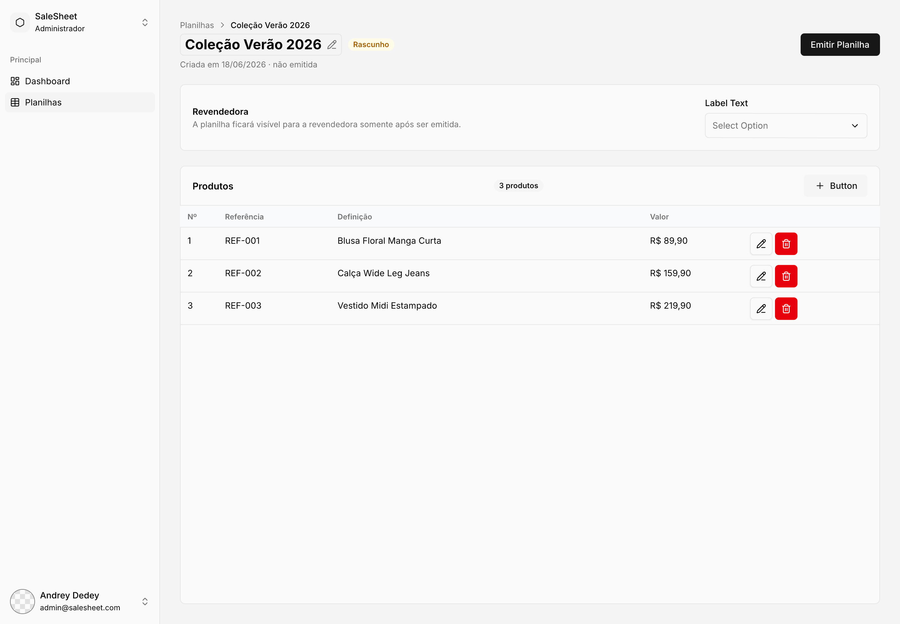
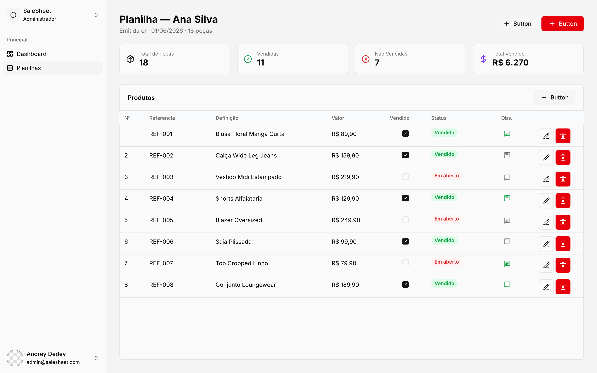
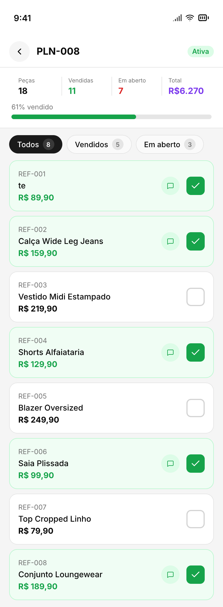
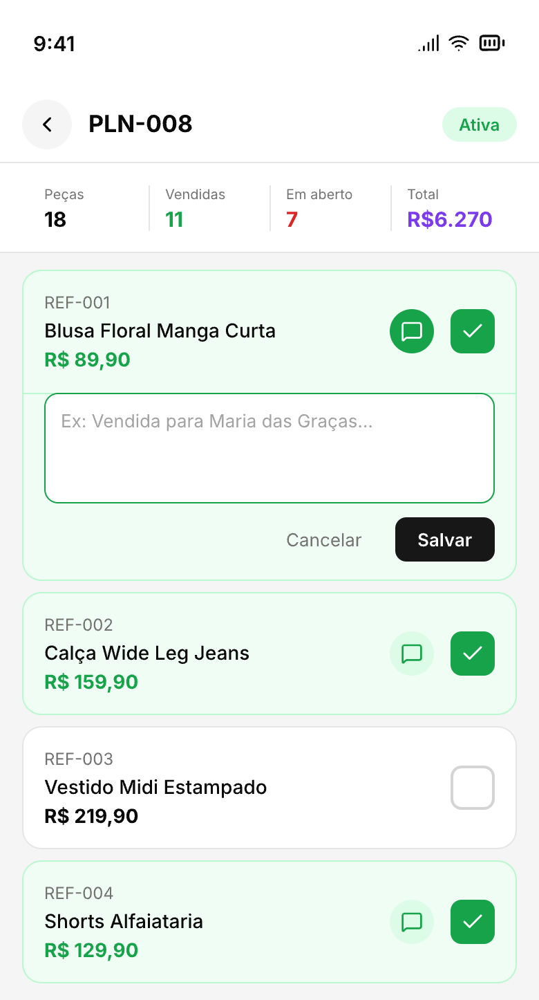

# SaleSheet

SaleSheet is a sales sheet management application designed for small businesses that work with resellers. Admins create product spreadsheets, assign them to salespersons, and publish them. Salespersons access their spreadsheets from a mobile-first interface, mark items as sold, and add notes per product.

The back-end was built with **Spring Boot** and uses **Google OAuth2** for authentication, while the front-end was built with **React** and **TypeScript**, optimized for mobile use on the salesperson side. All data is persisted in a **PostgreSQL** database using **Spring Data JPA**.

## 🔧 Main Technologies

**Back-end**
- **Spring Boot** – API framework
- **Spring Security + OAuth2** – Google login and route protection
- **Spring Data JPA / Hibernate** – ORM and database access
- **PostgreSQL** – Relational database
- **Flyway** – Database migrations
- **Lombok** – Boilerplate reduction

**Front-end**
- **React 19** – Graphical interface
- **TypeScript** – Static typing
- **TanStack Query** – Server state management, data fetching, and optimistic updates
- **React Hook Form + Zod** – Form handling and validation
- **Tailwind CSS v4** – Styling
- **shadcn/ui** – Component library
- **React Router v7** – Client-side routing
- **Axios** – HTTP client
- **Sonner** – Toast notifications

## 👤 Roles

**Admin** (desktop)
- Dashboard with total revenue, active spreadsheets, and salesperson stats
- Manage salespersons (invite, edit, delete)
- Create spreadsheets, add products, assign to a salesperson
- Publish (emit) spreadsheets to make them visible to salespersons
- Deactivate spreadsheets to make them read-only

**Salesperson** (mobile)
- View their assigned spreadsheets (Active and Inactive only — never Draft)
- Mark products as sold with optimistic UI updates
- Add notes per product
- Filter products by All / Sold / Open

## 📸 Screenshots

### Admin

| Dashboard | Planilhas |
|---|---|
|  |  |

| Editor (Rascunho) | Planilha Emitida |
|---|---|
|  |  |

### Salesperson (Mobile)

| Lista de Produtos | Adicionar Observação |
|---|---|
|  |  |

## ▶️ Running the project

**Prerequisites:** Java 21, Bun and Docker

**1. Start the database**
```bash
docker-compose up -d
```

**2. Run the back-end**
```bash
cd server/saleSheet
./mvnw spring-boot:run
```
The API will be available at `http://localhost:8080`

**3. Run the front-end**
```bash
cd client
bun install
bun run dev
```
The application will be available at `http://localhost:5173`
